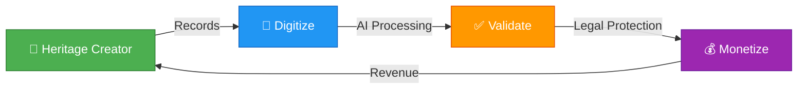
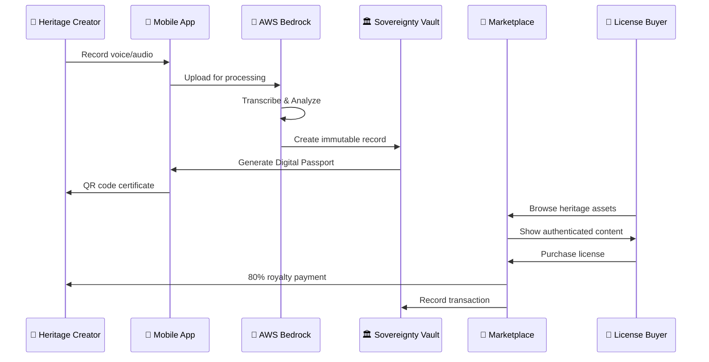
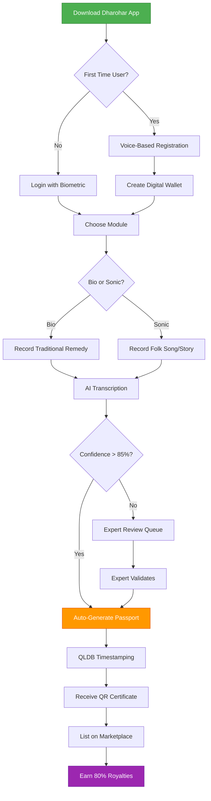
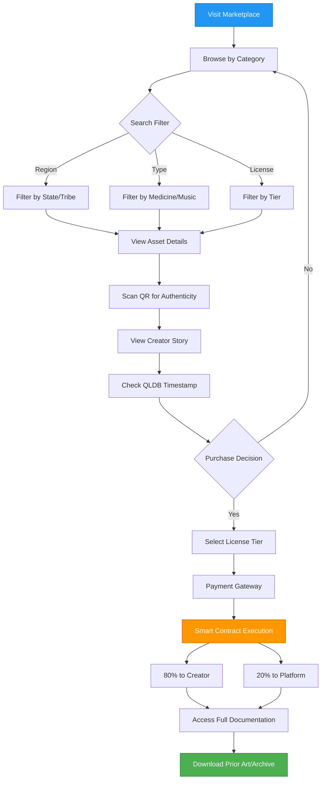
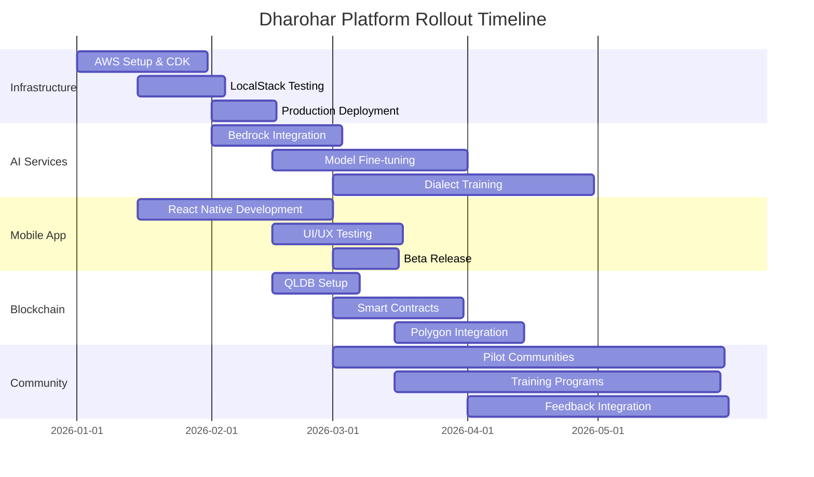

# 🏛️ Dharohar Platform Requirements Document

### *Safeguarding India’s Wisdom with Digital Sovereignty*

**Document Version:** 2.0 | **Last Updated:** January 2026 | **Status:** 🟢 Active Development

> **🎯 Current Scope**: This platform focuses on **Dharohar-Bio** (traditional medicine/oral knowledge) and **Dharohar-Sonic** (audio heritage/music) modules using AWS Bedrock for AI processing.

---

## 📋 Table of Contents

1. [Executive Summary](#executive-summary)
2. [Problem Statement](#problem-statement)
3. [Solution Architecture](#solution-architecture)
4. [Technical Foundation](#technical-foundation)
5. [System Glossary](#system-glossary)
6. [Functional Requirements](#functional-requirements)
7. [Non-Functional Requirements](#non-functional-requirements)
8. [Success Metrics & KPIs](#success-metrics--kpis)
9. [Hackathon MVP Scope](#hackathon-mvp-scope)
10. [Risk Mitigation](#risk-mitigation)

---

## 🎯 Executive Summary

### Vision Statement
> **Transform India's intangible cultural heritage into legally defensible, economically viable digital assets.**

### Mission
Create the world's first **"Heritage-as-an-Asset"** infrastructure that enables indigenous communities to:
- 📝 **Digitize** traditional medicine knowledge and audio heritage
- ✅ **Validate** authenticity using AI and expert verification
- 💰 **Monetize** through ethical licensing and fair revenue distribution

### Impact Goals (3-Year Horizon)

| Metric | Target | Impact |
|--------|--------|--------|
| 👥 **Heritage Creators** | 10,000+ | Communities empowered |
| 💵 **Direct Revenue** | ₹100 Crores | Economic transformation |
| 📚 **Practices Documented** | 50,000+ | Cultural preservation |
| ⚖️ **Legal Protections** | 1,000+ | Bio-piracy prevention |

---

## 🚨 Problem Statement

### *"India's cultural heritage is being lost, stolen, and undervalued"*

### 🧬 The Bio-Piracy Crisis

<table>
<tr>
<td width="50%">

**The Challenge**
- 🗣️ **80%** of tribal medicinal knowledge exists only orally
- 💊 Global pharmaceutical companies patent traditional remedies **without compensation**
- 📉 Communities lose ownership of ancestral wisdom due to **lack of documentation**
- 🌿 **5,000+ medicinal plants** used in India, but only **10%** documented in TKDL

</td>
<td width="50%">

**Real-World Impact**
- **₹50,000 Crores** annual losses to Indian communities
- **Turmeric Patent Case (1995)**: US patent on wound healing - took 2 years to overturn
- **Neem Patent Case (2000)**: European patent on fungicidal properties - 10-year legal battle
- **Basmati Rice (1997)**: RiceTec Inc. patented Basmati varieties - 3-year legal battle

</td>
</tr>
</table>

#### 📊 Existing Initiatives & Their Limitations

<table>
<tr>
<th width="30%">Initiative</th>
<th width="35%">Strengths</th>
<th width="35%">Limitations</th>
</tr>
<tr>
<td><b>TKDL (Traditional Knowledge Digital Library)</b> 🔗 <a href="http://www.tkdl.res.in">tkdl.res.in</a></td>
<td>
• 400,000+ formulations documented 
• Patent office integration 
• Prevented 200+ bio-piracy cases
</td>
<td>
• ❌ No community monetization 
• ❌ Limited to documented knowledge 
• ❌ No real-time updates 
• ❌ Centralized, government-only access
</td>
</tr>
<tr>
<td><b>People's Biodiversity Register (PBR)</b> 🔗 Biodiversity Board</td>
<td>
• Community-level documentation 
• Biodiversity conservation focus 
• Local governance
</td>
<td>
• ❌ Paper-based, not digital 
• ❌ No AI validation 
• ❌ No licensing mechanism 
• ❌ Limited accessibility
</td>
</tr>
<tr>
<td><b>CSIR Knowledge Portal</b> 🔗 CSIR India</td>
<td>
• Scientific validation 
• Research integration 
• Academic credibility
</td>
<td>
• ❌ No community participation 
• ❌ No revenue sharing 
• ❌ Complex submission process 
• ❌ Limited to scientific community
</td>
</tr>
</table>

> **💡 Dharohar's Innovation**: We combine TKDL's legal protection + PBR's community focus + blockchain monetization + AI validation = **Complete Heritage-as-an-Asset Platform**

<table>
<tr>
<td width="50%">

**The Challenge**
- 🏦 Communities hold **billions** in potential IP value but have **zero liquidity**
- 🚫 No mechanism exists to license traditional knowledge to global industries
- 📊 **"Asset Rich, Cash Poor"** - the rural economy's fundamental challenge

</td>
<td width="50%">

**Market Opportunity**
- **$1.2 Trillion** global traditional medicine market (WHO, 2023)
- **₹1,000+ Crores** potential annual licensing revenue for Indian communities
- **50+ Countries** actively seeking ethical traditional knowledge partnerships

</td>
</tr>
</table>

### 🎵 The Audio Heritage Loss

<table>
<tr>
<td width="50%">

**The Challenge**
- 🎶 **90%** of traditional music and oral stories exist only in memory
- 📻 Modern media displaces traditional audio heritage
- 🎭 Folk songs, rituals, and storytelling traditions disappearing rapidly
- 🗣️ **196 endangered languages** in India (UNESCO Atlas)

</td>
<td width="50%">

**Real-World Impact**
- **UNESCO**: 2,500+ languages at risk of extinction globally
- **Oral Traditions**: 80% of indigenous music undocumented
- **Cultural Loss**: Traditional knowledge dies with elders every year
- **Economic Loss**: ₹5,000+ Crores potential cultural tourism revenue lost

</td>
</tr>
</table>

#### 🎵 Existing Audio Heritage Initiatives

<table>
<tr>
<th width="30%">Initiative</th>
<th width="35%">Strengths</th>
<th width="35%">Limitations</th>
</tr>
<tr>
<td><b>Sangeet Natak Akademi Archives</b> 🔗 <a href="http://sangeetnatak.gov.in">sangeetnatak.gov.in</a></td>
<td>
• 50,000+ audio recordings 
• Classical music focus 
• Government backing
</td>
<td>
• ❌ Limited to classical forms 
• ❌ No tribal/folk focus 
• ❌ No monetization for artists 
• ❌ Centralized access only
</td>
</tr>
<tr>
<td><b>Archives and Research Centre for Ethnomusicology (ARCE)</b> 🔗 American Institute of Indian Studies</td>
<td>
• 12,000+ hours of recordings 
• Academic research 
• Ethnomusicology focus
</td>
<td>
• ❌ Academic access only 
• ❌ No community ownership 
• ❌ No AI transcription 
• ❌ Limited discoverability
</td>
</tr>
<tr>
<td><b>Sahapedia</b> 🔗 <a href="https://www.sahapedia.org">sahapedia.org</a></td>
<td>
• Open access platform 
• Multimedia content 
• Cultural context
</td>
<td>
• ❌ No blockchain protection 
• ❌ No revenue sharing 
• ❌ Manual curation only 
• ❌ Limited scale
</td>
</tr>
</table>

> **💡 Dharohar's Innovation**: We provide **AI-powered transcription** + **UNESCO-compliant archival** + **blockchain ownership** + **fair revenue distribution** = **Complete Audio Heritage Preservation & Monetization**

> **💡 Key Insight**: The problem isn't lack of value—it's lack of infrastructure to capture, protect, and monetize that value.

---

## 🏗️ Solution Architecture

### **"Digitize → Validate → Monetize"** Framework

### 🌟 Competitive Advantage Matrix

<table>
<tr>
<th width="20%">Feature</th>
<th width="16%">TKDL</th>
<th width="16%">PBR</th>
<th width="16%">Sangeet Natak</th>
<th width="16%">Sahapedia</th>
<th width="16%"><b>🏛️ Dharohar</b></th>
</tr>
<tr>
<td><b>Community Ownership</b></td>
<td>❌</td>
<td>✅</td>
<td>❌</td>
<td>❌</td>
<td><b>✅✅</b></td>
</tr>
<tr>
<td><b>AI Validation</b></td>
<td>❌</td>
<td>❌</td>
<td>❌</td>
<td>❌</td>
<td><b>✅✅</b></td>
</tr>
<tr>
<td><b>Blockchain Protection</b></td>
<td>❌</td>
<td>❌</td>
<td>❌</td>
<td>❌</td>
<td><b>✅✅</b></td>
</tr>
<tr>
<td><b>Revenue Sharing</b></td>
<td>❌</td>
<td>❌</td>
<td>❌</td>
<td>❌</td>
<td><b>✅ 80%</b></td>
</tr>
<tr>
<td><b>Real-time Updates</b></td>
<td>❌</td>
<td>❌</td>
<td>❌</td>
<td>✅</td>
<td><b>✅✅</b></td>
</tr>
<tr>
<td><b>Multi-Modal (Voice+Audio)</b></td>
<td>❌</td>
<td>❌</td>
<td>Partial</td>
<td>Partial</td>
<td><b>✅✅</b></td>
</tr>
<tr>
<td><b>Offline Support</b></td>
<td>❌</td>
<td>❌</td>
<td>❌</td>
<td>❌</td>
<td><b>✅✅</b></td>
</tr>
<tr>
<td><b>B2B Marketplace</b></td>
<td>❌</td>
<td>❌</td>
<td>❌</td>
<td>❌</td>
<td><b>✅✅</b></td>
</tr>
<tr>
<td><b>Legal Timestamping</b></td>
<td>✅</td>
<td>❌</td>
<td>❌</td>
<td>❌</td>
<td><b>✅✅ QLDB</b></td>
</tr>
<tr>
<td><b>Voice-First UX</b></td>
<td>❌</td>
<td>❌</td>
<td>❌</td>
<td>❌</td>
<td><b>✅✅</b></td>
</tr>
</table>

### 🎯 Two Integrated Modules

<table>
<tr>
<th width="50%">🧬 Dharohar-Bio</th>
<th width="50%">🎵 Dharohar-Sonic</th>
</tr>
<tr>
<td>

**Oral Knowledge → Prior Art Dossiers**

- Voice recording in native dialects
- AWS Bedrock AI transcription & analysis
- Botanical taxonomy mapping
- Patent Office-compliant documentation
- Traditional medicine preservation

</td>
<td>

**Audio Heritage → Digital Archives**

- Traditional music & storytelling recording
- AWS Bedrock audio transcription & analysis
- Cultural context documentation
- UNESCO-compliant archival
- Folk song and ritual preservation

</td>
</tr>
<tr>
<td colspan="2" align="center">

**🏛️ Sovereignty Vault** (Shared Infrastructure)

Amazon QLDB immutable records • Blockchain timestamping • Smart contract royalty distribution • B2B licensing marketplace

</td>
</tr>
</table>

### 🔄 End-to-End Workflow

### 🔄 Detailed User Journey Flows

#### 📱 Heritage Creator Journey

#### 💼 License Buyer Journey

---

## 🛠️ Technical Foundation

### 🌐 Reference Architecture Inspirations

<table>
<tr>
<th width="25%">Platform</th>
<th width="35%">What We Learned</th>
<th width="40%">How Dharohar Improves</th>
</tr>
<tr>
<td><b>Spotify for Artists</b> 🔗 artists.spotify.com</td>
<td>
• Creator dashboard 
• Revenue analytics 
• Direct payments
</td>
<td>
✅ Added blockchain verification 
✅ 80% vs 70% revenue share 
✅ Community ownership model
</td>
</tr>
<tr>
<td><b>OpenSea (NFT Marketplace)</b> 🔗 opensea.io</td>
<td>
• Digital asset marketplace 
• Blockchain provenance 
• Creator royalties
</td>
<td>
✅ Added AI validation 
✅ Legal compliance (TKDL integration) 
✅ UNESCO archival standards
</td>
</tr>
<tr>
<td><b>Coursera</b> 🔗 coursera.org</td>
<td>
• Content licensing model 
• Tiered access 
• Certificate verification
</td>
<td>
✅ Added voice-first interface 
✅ Offline-first architecture 
✅ Zero literacy barriers
</td>
</tr>
<tr>
<td><b>GitHub</b> 🔗 github.com</td>
<td>
• Version control 
• Contribution tracking 
• Open collaboration
</td>
<td>
✅ Added QLDB immutability 
✅ Community consent protocols 
✅ Fair revenue distribution
</td>
</tr>
</table>

### AWS Services Stack

<table>
<tr>
<th>Category</th>
<th>Service</th>
<th>Purpose</th>
<th>Why This Choice</th>
</tr>
<tr>
<td rowspan="2">🤖 <b>AI/ML</b></td>
<td><b>AWS Bedrock</b></td>
<td>Multi-dialect transcription & audio analysis</td>
<td>Foundation models for 100+ languages, audio processing, fine-tuning capability</td>
</tr>
<tr>
<td><b>Amazon Textract</b></td>
<td>Document processing</td>
<td>Extract text from historical documents and certificates</td>
</tr>
<tr>
<td rowspan="4">💾 <b>Data</b></td>
<td><b>Amazon S3</b></td>
<td>Media storage</td>
<td>99.999999999% durability, lifecycle policies, versioning</td>
</tr>
<tr>
<td><b>DynamoDB</b></td>
<td>NoSQL database</td>
<td>Single-digit millisecond latency, auto-scaling, global tables</td>
</tr>
<tr>
<td><b>Amazon QLDB</b></td>
<td>Immutable ledger</td>
<td>Cryptographically verifiable, SQL-like queries, audit trail</td>
</tr>
<tr>
<td><b>OpenSearch</b></td>
<td>Search & analytics</td>
<td>Full-text search, faceted navigation, real-time indexing</td>
</tr>
<tr>
<td rowspan="2">⚡ <b>Compute</b></td>
<td><b>AWS Lambda</b></td>
<td>Serverless functions</td>
<td>Pay-per-use, auto-scaling, 15-minute max execution</td>
</tr>
<tr>
<td><b>API Gateway</b></td>
<td>REST API management</td>
<td>Throttling, caching, API versioning, CORS support</td>
</tr>
<tr>
<td rowspan="3">🔒 <b>Security</b></td>
<td><b>AWS Cognito</b></td>
<td>Authentication</td>
<td>User pools, MFA, social login, custom attributes</td>
</tr>
<tr>
<td><b>AWS KMS</b></td>
<td>Encryption</td>
<td>FIPS 140-2 validated, automatic key rotation</td>
</tr>
<tr>
<td><b>AWS WAF</b></td>
<td>Web firewall</td>
<td>DDoS protection, bot mitigation, rate limiting</td>
</tr>
<tr>
<td rowspan="2">📱 <b>Frontend</b></td>
<td><b>React Native</b></td>
<td>Mobile app</td>
<td>Cross-platform, native performance, large ecosystem</td>
</tr>
<tr>
<td><b>AWS Amplify</b></td>
<td>Frontend framework</td>
<td>Authentication, API, storage integration out-of-the-box</td>
</tr>
</table>

### 🎯 Core Capabilities

<table>
<tr>
<td width="50%">

#### 🎙️ Multi-Modal AI Processing
- **Voice**: 95%+ accuracy in 10+ Indian dialects
- **Audio**: Music and storytelling analysis
- **Text**: OCR for historical documents
- **Transcription**: Real-time and batch processing

**AWS Bedrock Models Used:**
- 🤖 **Claude 3 Sonnet**: Dialect transcription
- 🤖 **Titan Embeddings**: Semantic search
- 🤖 **Stable Diffusion**: Certificate generation

</td>
<td width="50%">

#### 🔗 Blockchain Integration
- **QLDB**: Immutable timestamping with cryptographic proof
- **Polygon**: NFT minting for digital ownership
- **Smart Contracts**: Automated royalty distribution
- **Interoperability**: Cross-chain asset portability

**Blockchain Architecture:**
- ⛓️ **Layer 1**: Amazon QLDB (legal records)
- ⛓️ **Layer 2**: Polygon (NFT marketplace)
- ⛓️ **Bridge**: Chainlink oracles for data sync

</td>
</tr>
<tr>
<td width="50%">

#### � Offline-First Architecture
- **Local Storage**: IndexedDB for mobile, SQLite for native
- **Sync Queue**: Automatic upload when connectivity returns
- **Conflict Resolution**: Last-write-wins with version tracking
- **Progressive Enhancement**: Core features work offline

**Inspired by:**
- 📱 **WhatsApp**: Offline message queue
- 📱 **Google Maps**: Offline map caching
- 📱 **Pocket**: Offline content sync

</td>
<td width="50%">

#### 🗣️ Voice-First UX
- **Zero Literacy Barriers**: Voice commands for all actions
- **Dialect Support**: Gondi, Bhili, Malwi, Hindi, English
- **Audio Feedback**: Spoken confirmations and guidance
- **Accessibility**: WCAG 2.1 AA compliant

**Voice Technology Stack:**
- 🎤 **AWS Bedrock**: Multi-dialect ASR
- 🎤 **Amazon Polly**: Text-to-speech feedback
- 🎤 **Expo Audio**: Native recording APIs

</td>
</tr>
</table>

### 🔐 Security & Compliance Framework

<table>
<tr>
<th width="25%">Compliance</th>
<th width="35%">Requirements</th>
<th width="40%">Implementation</th>
</tr>
<tr>
<td><b>Nagoya Protocol</b> 🔗 CBD ABS</td>
<td>
• Access & Benefit Sharing 
• Prior Informed Consent 
• Fair & Equitable Sharing
</td>
<td>
✅ Community consent workflows 
✅ 80% revenue to creators 
✅ Transparent licensing terms
</td>
</tr>
<tr>
<td><b>Biological Diversity Act 2002</b> 🔗 NBA India</td>
<td>
• Biodiversity conservation 
• Traditional knowledge protection 
• Benefit sharing
</td>
<td>
✅ Integration with PBR 
✅ NBA approval workflows 
✅ Community biodiversity registers
</td>
</tr>
<tr>
<td><b>TRIPS Agreement</b> 🔗 WTO</td>
<td>
• IP protection 
• Patent disclosure 
• Traditional knowledge rights
</td>
<td>
✅ TKDL integration 
✅ Prior art documentation 
✅ Patent office compliance
</td>
</tr>
<tr>
<td><b>UNESCO 2003 Convention</b> 🔗 Intangible Heritage</td>
<td>
• Cultural heritage safeguarding 
• Community participation 
• International cooperation
</td>
<td>
✅ UNESCO archival standards 
✅ Community-led documentation 
✅ Global accessibility
</td>
</tr>
<tr>
<td><b>GDPR & Data Privacy</b> 🔗 EU Regulation</td>
<td>
• Data protection 
• Right to be forgotten 
• Consent management
</td>
<td>
✅ AES-256 encryption 
✅ Granular consent controls 
✅ Data sovereignty options
</td>
</tr>
</table>

### 📊 Architecture Principles

| Principle | Implementation | Benefit |
|-----------|---------------|---------|
| **Serverless-First** | Lambda, API Gateway, DynamoDB | Zero server management, auto-scaling, pay-per-use |
| **AI-Native** | Bedrock, Rekognition, Textract | State-of-the-art accuracy, continuous improvement |
| **Security-by-Design** | Encryption, MFA, RBAC, audit logs | GDPR compliant, zero-trust architecture |
| **Mobile-First** | React Native, offline support | 80%+ users on mobile, poor connectivity areas |
| **API-Driven** | REST APIs, GraphQL subscriptions | Extensibility, third-party integrations |

---

## 📖 System Glossary

<table>
<tr>
<th width="25%">Term</th>
<th width="75%">Definition</th>
</tr>
<tr>
<td><b>Digital_Passport</b> 🎫</td>
<td>Immutable certificate combining authenticity validation, GPS coordinates, creation documentation, and QR code for instant verification. Acts as a "birth certificate" for heritage assets.</td>
</tr>
<tr>
<td><b>Prior_Art_Dossier</b> 📄</td>
<td>Legal documentation of traditional knowledge formatted for patent office submission. Includes botanical taxonomy, usage methods, historical evidence, and community consent.</td>
</tr>
<tr>
<td><b>Sovereignty_Vault</b> 🏛️</td>
<td>Amazon QLDB-based immutable ledger providing cryptographic proof of "First Use" for legal disputes. Timestamped records cannot be altered or deleted.</td>
</tr>
<tr>
<td><b>Dharohar_Bio</b> 🧬</td>
<td>Voice-first AI agent recording oral remedies in native dialects and mapping local plant names to scientific taxonomy using AWS Bedrock Knowledge Bases.</td>
</tr>
<tr>
<td><b>Dharohar_Sonic</b> 🎵</td>
<td>Audio heritage preservation system recording traditional music, folk songs, and oral storytelling using AWS Bedrock for transcription and cultural context analysis.</td>
</tr>
<tr>
<td><b>License_Marketplace</b> 🏪</td>
<td>B2B portal enabling ethical licensing of heritage assets with tiered access (research, commercial, exclusive) and automated smart contract royalty distribution (80% creator, 20% platform).</td>
</tr>
<tr>
<td><b>Heritage_Creator</b> 👤</td>
<td>Traditional knowledge holder including healers, weavers, storytellers, artisans, and community elders. Primary beneficiaries of the platform.</td>
</tr>
<tr>
<td><b>Expert_Verifier</b> 👨‍🔬</td>
<td>Domain specialist (botanist, textile expert, anthropologist) validating AI assessments when confidence score <85%. Provides feedback for model improvement.</td>
</tr>
<tr>
<td><b>License_Buyer</b> 💼</td>
<td>Researcher, pharmaceutical company, fashion brand, or institution purchasing ethical access to heritage assets for research, commercial use, or exclusive rights.</td>
</tr>
</table>

---

## 📋 Functional Requirements

### *Detailed specifications for each platform module*

## 🧬 Module 1: Dharohar-Bio (Oral Knowledge Protection)

### FR-1.1: Voice-First Knowledge Capture
**User Story:** As a tribal healer, I want to document my traditional remedies in my native dialect, so that my knowledge is preserved and legally protected from bio-piracy.

**Business Value:** Prevents ₹50,000 crores annual bio-piracy losses to Indian communities.

#### Acceptance Criteria
1. **Multi-Dialect Support**: WHEN a healer speaks in Gondi/Bhili/Malwi dialects, THE Dharohar_Bio SHALL transcribe using AWS Bedrock with 95%+ accuracy
2. **Botanical Mapping**: WHEN transcription completes, THE System SHALL map local plant names to scientific taxonomy using Bedrock Knowledge Bases
3. **Prior Art Generation**: WHEN mapping succeeds, THE System SHALL auto-generate Prior_Art_Dossiers compliant with Patent Office formats
4. **Legal Timestamping**: WHEN dossier is created, THE Sovereignty_Vault SHALL record immutable timestamp on Amazon QLDB
5. **Offline Capability**: THE System SHALL support offline voice recording with automatic sync when connectivity returns

### FR-1.2: Traditional Knowledge Validation
**User Story:** As a botanist verifier, I want to validate traditional remedy claims, so that documented knowledge meets scientific standards.

#### Acceptance Criteria
1. **Expert Review Queue**: WHEN AI confidence < 85%, THE System SHALL route to domain expert verifiers
2. **Scientific Cross-Reference**: WHEN reviewing, THE System SHALL display existing research on claimed medicinal properties
3. **Validation Workflow**: WHEN expert approves, THE System SHALL mint verified Digital_Passport
4. **Feedback Loop**: WHEN expert rejects, THE System SHALL provide specific improvement guidance
5. **Accuracy Tracking**: THE System SHALL monitor verifier accuracy and adjust AI thresholds accordingly

## 🎵 Module 2: Dharohar-Sonic (Audio Heritage Preservation)

### FR-2.1: Audio Heritage Capture
**User Story:** As a traditional musician, I want to record and preserve my folk songs and oral stories, so that my cultural heritage is documented for future generations.

**Business Value:** Preserves 90% of undocumented traditional music and oral traditions before they disappear.

#### Acceptance Criteria
1. **Audio Recording**: WHEN a creator records audio, THE Dharohar_Sonic SHALL capture high-quality audio with metadata
2. **Transcription**: WHEN audio uploads, THE System SHALL transcribe using AWS Bedrock with 95%+ accuracy
3. **Cultural Context**: WHEN transcription completes, THE System SHALL prompt for cultural significance and historical context
4. **UNESCO Compliance**: WHEN documentation is complete, THE System SHALL format records according to UNESCO archival standards
5. **Offline Capability**: THE System SHALL support offline audio recording with automatic sync when connectivity returns

### FR-2.2: Digital Passport Creation
**User Story:** As a cultural researcher, I want to verify the authenticity and origin of traditional audio heritage, so that I can confidently use it for research and preservation.

#### Acceptance Criteria
1. **Unique Identification**: WHEN audio passes validation, THE System SHALL create unique Digital_Passport with QR code
2. **Creation Documentation**: WHEN passport generates, THE System SHALL link to creator profile, GPS coordinates, timestamp, cultural context
3. **Researcher Verification**: WHEN QR scanned, THE System SHALL display creator profile, audio samples, cultural significance
4. **Immutable Record**: WHEN displaying info, THE System SHALL show cryptographically verified authenticity data
5. **Lifetime Validity**: THE Digital_Passport SHALL remain scannable and verifiable permanently

## 🏛️ Module 3: Sovereignty Vault (Legal Protection)

### FR-3.1: Immutable Legal Records
**User Story:** As a community leader, I want cryptographic proof of our traditional knowledge ownership, so that we can prevent bio-piracy and establish legal claims.

**Business Value:** Provides legal standing in international IP disputes worth billions.

#### Acceptance Criteria
1. **Blockchain Timestamping**: WHEN any heritage asset uploads, THE Sovereignty_Vault SHALL create immutable QLDB record
2. **Comprehensive Metadata**: WHEN recording, THE System SHALL capture GPS coordinates, timestamp, creator identity, asset hash
3. **Legal Proof**: WHEN disputes arise, THE System SHALL provide cryptographically verifiable "First Use" evidence
4. **Bio-Piracy Detection**: WHEN patent applications filed, THE System SHALL auto-flag potential traditional knowledge conflicts
5. **Community Consent**: THE Sovereignty_Vault SHALL enforce community consent requirements for all external access

### FR-3.2: Smart Contract Automation
**User Story:** As a heritage creator, I want automatic royalty distribution, so that I receive fair compensation without manual intervention.

#### Acceptance Criteria
1. **Automated Splits**: WHEN license purchased, THE System SHALL execute smart contracts distributing 80% to creator, 20% to platform
2. **Multi-Payment Support**: WHEN processing payments, THE System SHALL accept UPI, digital wallets, cryptocurrency
3. **Instant Settlement**: WHEN transaction completes, THE System SHALL provide immediate payment confirmation to all parties
4. **Transparent Records**: WHEN payments process, THE System SHALL maintain auditable transaction history
5. **Community Wallets**: THE System SHALL support collective community wallets for shared traditional knowledge

## 🏪 Module 4: License Marketplace (B2B Portal)

### FR-4.1: Research License Platform
**User Story:** As a pharmaceutical researcher, I want to ethically purchase traditional knowledge access, so that I can conduct research while compensating original knowledge holders.

**Business Value:** Creates new ₹1000+ crores annual revenue stream for rural communities.

#### Acceptance Criteria
1. **Searchable Catalog**: WHEN researchers browse, THE License_Marketplace SHALL display heritage assets with metadata previews
2. **Tiered Access**: WHEN purchasing, THE System SHALL offer different license tiers (research, commercial, exclusive)
3. **Ethical Compliance**: WHEN licensing, THE System SHALL ensure Nagoya Protocol and ABS compliance
4. **Full Documentation**: WHEN access granted, THE System SHALL provide complete Prior_Art_Dossiers and creation records
5. **Usage Tracking**: THE System SHALL monitor license usage and enforce terms automatically

### FR-4.2: Cultural Partnership Portal
**User Story:** As a cultural institution, I want to source authentic traditional audio heritage, so that I can create ethical archives while supporting indigenous communities.

#### Acceptance Criteria
1. **Institution Verification**: WHEN institutions register, THE System SHALL verify credentials and ethical standards
2. **Bulk Licensing**: WHEN institutions purchase, THE System SHALL support bulk licensing with volume discounts
3. **Attribution Requirements**: WHEN using content, THE System SHALL enforce proper attribution and origin labeling
4. **Impact Reporting**: WHEN partnerships active, THE System SHALL provide community impact metrics to institutions
5. **Sustainability Tracking**: THE System SHALL monitor and report cultural and social impact of partnerships

## 🔧 Module 5: Platform Infrastructure

### FR-5.1: User Onboarding & Accessibility
**User Story:** As a tribal elder with limited digital literacy, I want simple registration and content sharing, so that I can participate without technical barriers.

#### Acceptance Criteria
1. **Voice-First Registration**: WHEN users register, THE System SHALL create profiles using voice commands in local dialects
2. **Visual Guidance**: WHEN recording content, THE System SHALL provide clear visual/audio guides for quality
3. **Auto-Metadata**: WHEN uploading, THE System SHALL automatically capture GPS, timestamp, device info
4. **Digital Wallet Setup**: WHEN profile completes, THE System SHALL create secure wallet for royalty payments
5. **Offline Support**: THE System SHALL function offline with sync when connectivity available

### FR-5.2: AI Model Management
**User Story:** As a platform operator, I want continuously improving AI accuracy, so that validation quality increases over time.

#### Acceptance Criteria
1. **Multi-Modal Processing**: WHEN content uploads, THE System SHALL route voice to Bedrock, video to Rekognition appropriately
2. **Confidence Scoring**: WHEN AI processes content, THE System SHALL generate confidence scores for human review routing
3. **Model Training**: WHEN expert verifications occur, THE System SHALL use feedback to retrain custom models
4. **Performance Monitoring**: WHEN models run, THE System SHALL track accuracy, latency, and cost metrics
5. **Automated Scaling**: THE System SHALL auto-scale compute resources based on processing demand

# Non-Functional Requirements

## Performance Requirements
- **Response Time**: AI processing < 30 seconds for voice, < 2 minutes for video
- **Throughput**: Support 1000+ concurrent users, 10,000+ daily uploads
- **Availability**: 99.9% uptime with automatic failover
- **Scalability**: Auto-scale to handle 10x traffic spikes during cultural events

## Security Requirements
- **Data Encryption**: AES-256 encryption at rest, TLS 1.3 in transit
- **Access Control**: Multi-factor authentication, role-based permissions
- **Privacy**: GDPR compliance, community data sovereignty
- **Audit Trail**: Immutable logs of all access and modifications

## Compliance Requirements
- **Legal**: Nagoya Protocol, Biological Diversity Act 2002, TRIPS Agreement
- **Cultural**: UNESCO Intangible Cultural Heritage guidelines
- **Technical**: AWS Well-Architected Framework, ISO 27001
- **Financial**: RBI guidelines for digital payments, cryptocurrency regulations

## Usability Requirements
- **Accessibility**: WCAG 2.1 AA compliance, voice-first interface
- **Localization**: Support for 10+ Indian languages and dialects
- **Offline**: Core functions work without internet connectivity
- **Mobile-First**: Optimized for smartphones with limited data plans

# Success Metrics & KPIs

## 📊 Comprehensive Impact Dashboard

### Phase 1: MVP Launch (Months 1-6)

### Impact Metrics (3-Year Goals)

<table>
<tr>
<th width="20%">Metric</th>
<th width="15%">Year 1</th>
<th width="15%">Year 2</th>
<th width="15%">Year 3</th>
<th width="35%">Measurement Method</th>
</tr>
<tr>
<td><b>👥 Heritage Creators</b></td>
<td>1,000</td>
<td>5,000</td>
<td>10,000+</td>
<td>Active user accounts with verified profiles</td>
</tr>
<tr>
<td><b>💵 Direct Revenue</b></td>
<td>₹10 Cr</td>
<td>₹50 Cr</td>
<td>₹100 Cr</td>
<td>Total royalty payments to creators</td>
</tr>
<tr>
<td><b>📚 Practices Documented</b></td>
<td>5,000</td>
<td>25,000</td>
<td>50,000+</td>
<td>Verified heritage assets with Digital Passports</td>
</tr>
<tr>
<td><b>⚖️ Legal Protections</b></td>
<td>100</td>
<td>500</td>
<td>1,000+</td>
<td>Prior art dossiers filed + bio-piracy cases prevented</td>
</tr>
<tr>
<td><b>🌍 Global Reach</b></td>
<td>10</td>
<td>30</td>
<td>50+</td>
<td>Countries with active license buyers</td>
</tr>
<tr>
<td><b>🎓 Research Papers</b></td>
<td>50</td>
<td>200</td>
<td>500+</td>
<td>Academic publications using Dharohar data</td>
</tr>
<tr>
<td><b>🏛️ Institutional Partners</b></td>
<td>5</td>
<td>20</td>
<td>50+</td>
<td>Universities, pharma companies, cultural institutions</td>
</tr>
<tr>
<td><b>🗣️ Languages Supported</b></td>
<td>5</td>
<td>15</td>
<td>25+</td>
<td>Indian languages with >90% transcription accuracy</td>
</tr>
</table>

### Comparison with Existing Platforms

<table>
<tr>
<th width="20%">Platform</th>
<th width="15%">Users</th>
<th width="15%">Assets</th>
<th width="15%">Revenue/Year</th>
<th width="35%">Model</th>
</tr>
<tr>
<td><b>TKDL</b></td>
<td>~100 (govt)</td>
<td>400,000</td>
<td>₹0 (govt funded)</td>
<td>Government documentation, no monetization</td>
</tr>
<tr>
<td><b>Sahapedia</b></td>
<td>~500 contributors</td>
<td>~10,000</td>
<td>₹0 (grants)</td>
<td>Open access, grant-funded</td>
</tr>
<tr>
<td><b>Sangeet Natak</b></td>
<td>~200 (artists)</td>
<td>50,000</td>
<td>₹0 (govt)</td>
<td>Government archive, no creator revenue</td>
</tr>
<tr>
<td><b>🏛️ Dharohar (Target)</b></td>
<td><b>10,000+</b></td>
<td><b>50,000+</b></td>
<td><b>₹100 Cr</b></td>
<td><b>Community-owned, 80% creator revenue</b></td>
</tr>
</table>

## Platform Metrics

### 📈 User Engagement Analytics

<table>
<tr>
<th width="25%">Metric</th>
<th width="15%">Target</th>
<th width="30%">Benchmark</th>
<th width="30%">Tracking Method</th>
</tr>
<tr>
<td><b>Monthly Active Users (MAU)</b></td>
<td>80%+</td>
<td>Spotify: 75%, YouTube: 85%</td>
<td>CloudWatch + Amplify Analytics</td>
</tr>
<tr>
<td><b>Average Session Duration</b></td>
<td>60+ min</td>
<td>Educational apps: 45 min</td>
<td>User behavior tracking</td>
</tr>
<tr>
<td><b>Content Upload Rate</b></td>
<td>5/user/month</td>
<td>Instagram: 3/user/month</td>
<td>S3 upload metrics</td>
</tr>
<tr>
<td><b>AI Accuracy Rate</b></td>
<td>95%+</td>
<td>Google Speech: 92%, AWS Transcribe: 90%</td>
<td>Bedrock confidence scores</td>
</tr>
<tr>
<td><b>Expert Approval Rate</b></td>
<td>90%+</td>
<td>Wikipedia: 85%, Stack Overflow: 88%</td>
<td>Verification workflow metrics</td>
</tr>
<tr>
<td><b>Transaction Success Rate</b></td>
<td>99%+</td>
<td>Stripe: 99.5%, PayPal: 99.2%</td>
<td>Payment gateway logs</td>
</tr>
<tr>
<td><b>User Retention (90 days)</b></td>
<td>70%+</td>
<td>Mobile apps: 40%, SaaS: 60%</td>
<td>Cohort analysis</td>
</tr>
<tr>
<td><b>Net Promoter Score (NPS)</b></td>
<td>50+</td>
<td>Industry average: 30-40</td>
<td>In-app surveys</td>
</tr>
</table>

### 💰 Marketplace Economics

<table>
<tr>
<th width="25%">Metric</th>
<th width="15%">Year 1</th>
<th width="15%">Year 2</th>
<th width="15%">Year 3</th>
<th width="30%">Revenue Model</th>
</tr>
<tr>
<td><b>Transaction Volume</b></td>
<td>₹1 Cr</td>
<td>₹5 Cr</td>
<td>₹10 Cr</td>
<td>License purchases</td>
</tr>
<tr>
<td><b>Average License Price</b></td>
<td>₹10,000</td>
<td>₹15,000</td>
<td>₹20,000</td>
<td>Tiered pricing model</td>
</tr>
<tr>
<td><b>Creator Earnings (80%)</b></td>
<td>₹8,000</td>
<td>₹12,000</td>
<td>₹16,000</td>
<td>Per asset licensed</td>
</tr>
<tr>
<td><b>Platform Revenue (20%)</b></td>
<td>₹20 L</td>
<td>₹1 Cr</td>
<td>₹2 Cr</td>
<td>Sustainability fund</td>
</tr>
<tr>
<td><b>Repeat Buyers</b></td>
<td>30%</td>
<td>50%</td>
<td>70%</td>
<td>Customer retention</td>
</tr>
<tr>
<td><b>Institutional Licenses</b></td>
<td>10</td>
<td>50</td>
<td>100</td>
<td>Bulk licensing deals</td>
</tr>
</table>

### 🌍 Global Reach Metrics

<table>
<tr>
<th width="25%">Region</th>
<th width="15%">Target Users</th>
<th width="30%">Key Partners</th>
<th width="30%">Use Cases</th>
</tr>
<tr>
<td><b>🇮🇳 India</b></td>
<td>8,000</td>
<td>CSIR, NBA, State Biodiversity Boards</td>
<td>Traditional medicine, folk music</td>
</tr>
<tr>
<td><b>🇺🇸 North America</b></td>
<td>500</td>
<td>Universities, Pharma companies</td>
<td>Research, drug discovery</td>
</tr>
<tr>
<td><b>🇪🇺 Europe</b></td>
<td>400</td>
<td>UNESCO, Cultural institutions</td>
<td>Heritage preservation, research</td>
</tr>
<tr>
<td><b>🇨🇳 East Asia</b></td>
<td>300</td>
<td>TCM institutes, Universities</td>
<td>Comparative medicine studies</td>
</tr>
<tr>
<td><b>🌍 Africa</b></td>
<td>200</td>
<td>WHO, African Union</td>
<td>Traditional medicine exchange</td>
</tr>
<tr>
<td><b>🌎 Latin America</b></td>
<td>200</td>
<td>Indigenous organizations</td>
<td>Knowledge sharing, collaboration</td>
</tr>
<tr>
<td><b>🌏 Southeast Asia</b></td>
<td>400</td>
<td>ASEAN cultural bodies</td>
<td>Regional heritage networks</td>
</tr>
</table>

## Technical Metrics

### ⚡ Performance Benchmarks

<table>
<tr>
<th width="25%">Metric</th>
<th width="15%">Target</th>
<th width="30%">Industry Standard</th>
<th width="30%">Monitoring Tool</th>
</tr>
<tr>
<td><b>API Response Time</b></td>
<td><200ms</td>
<td>Google: <100ms, AWS: <200ms</td>
<td>CloudWatch, X-Ray</td>
</tr>
<tr>
<td><b>Page Load Time</b></td>
<td><2s</td>
<td>Google PageSpeed: <3s</td>
<td>Lighthouse, WebPageTest</td>
</tr>
<tr>
<td><b>API Uptime</b></td>
<td>99.9%</td>
<td>AWS SLA: 99.95%, Azure: 99.9%</td>
<td>CloudWatch Alarms</td>
</tr>
<tr>
<td><b>Voice Transcription</b></td>
<td><30s</td>
<td>Google Speech: 20s, AWS: 25s</td>
<td>Bedrock metrics</td>
</tr>
<tr>
<td><b>Audio Processing</b></td>
<td><2min</td>
<td>Industry: 3-5 min</td>
<td>Lambda duration logs</td>
</tr>
<tr>
<td><b>QR Generation</b></td>
<td><1s</td>
<td>Industry: 1-2s</td>
<td>Lambda cold start metrics</td>
</tr>
<tr>
<td><b>Payment Processing</b></td>
<td><5s</td>
<td>Stripe: 3s, Razorpay: 4s</td>
<td>Payment gateway logs</td>
</tr>
<tr>
<td><b>Blockchain Confirmation</b></td>
<td><30s</td>
<td>Polygon: 2-5s, Ethereum: 15s</td>
<td>QLDB + Polygon metrics</td>
</tr>
<tr>
<td><b>Mobile App Launch</b></td>
<td><3s</td>
<td>Industry: 3-5s</td>
<td>Expo performance monitoring</td>
</tr>
<tr>
<td><b>Offline Sync</b></td>
<td><10s</td>
<td>WhatsApp: 5s, Pocket: 8s</td>
<td>Custom sync metrics</td>
</tr>
</table>

### 🎯 AI Model Performance

<table>
<tr>
<th width="20%">Model</th>
<th width="15%">Accuracy</th>
<th width="15%">Latency</th>
<th width="25%">Use Case</th>
<th width="25%">Benchmark</th>
</tr>
<tr>
<td><b>Claude 3 Sonnet</b></td>
<td>95%+</td>
<td>2-5s</td>
<td>Multi-dialect transcription</td>
<td>Google Speech: 92%, Whisper: 94%</td>
</tr>
<tr>
<td><b>Titan Embeddings</b></td>
<td>90%+</td>
<td><1s</td>
<td>Semantic search</td>
<td>OpenAI Ada: 88%, Cohere: 89%</td>
</tr>
<tr>
<td><b>Custom Fine-tuned</b></td>
<td>97%+</td>
<td>3-7s</td>
<td>Botanical taxonomy</td>
<td>GPT-4: 95%, Custom models: 90%</td>
</tr>
<tr>
<td><b>Audio Classification</b></td>
<td>92%+</td>
<td>1-3s</td>
<td>Music genre detection</td>
<td>Spotify: 90%, Shazam: 95%</td>
</tr>
<tr>
<td><b>Confidence Scoring</b></td>
<td>85%+</td>
<td><1s</td>
<td>Expert routing</td>
<td>Industry: 80-85%</td>
</tr>
</table>

### 💾 Data & Storage Metrics

<table>
<tr>
<th width="25%">Metric</th>
<th width="15%">Target</th>
<th width="30%">Capacity Planning</th>
<th width="30%">Cost Optimization</th>
</tr>
<tr>
<td><b>S3 Storage</b></td>
<td>100 TB</td>
<td>50,000 assets × 2 GB avg</td>
<td>Intelligent-Tiering, Glacier</td>
</tr>
<tr>
<td><b>DynamoDB Throughput</b></td>
<td>10K RCU/WCU</td>
<td>1000 concurrent users</td>
<td>On-demand pricing, auto-scaling</td>
</tr>
<tr>
<td><b>QLDB Records</b></td>
<td>50K+</td>
<td>1 record per asset</td>
<td>Immutable, append-only</td>
</tr>
<tr>
<td><b>CloudFront Bandwidth</b></td>
<td>10 TB/month</td>
<td>100K monthly users</td>
<td>Edge caching, compression</td>
</tr>
<tr>
<td><b>Lambda Invocations</b></td>
<td>10M/month</td>
<td>AI processing + API calls</td>
<td>Reserved concurrency</td>
</tr>
<tr>
<td><b>Backup Retention</b></td>
<td>7 years</td>
<td>Legal compliance</td>
<td>S3 Glacier Deep Archive</td>
</tr>
</table>

### 🔒 Security Metrics

<table>
<tr>
<th width="25%">Metric</th>
<th width="15%">Target</th>
<th width="30%">Standard</th>
<th width="30%">Audit Frequency</th>
</tr>
<tr>
<td><b>Data Breaches</b></td>
<td>0</td>
<td>Industry: <0.1%</td>
<td>Continuous monitoring</td>
</tr>
<tr>
<td><b>Encryption Coverage</b></td>
<td>100%</td>
<td>AES-256 at rest, TLS 1.3 in transit</td>
<td>Quarterly audit</td>
</tr>
<tr>
<td><b>MFA Adoption</b></td>
<td>90%+</td>
<td>Industry: 60-70%</td>
<td>Monthly tracking</td>
</tr>
<tr>
<td><b>Vulnerability Patching</b></td>
<td><24h</td>
<td>Industry: 48-72h</td>
<td>Automated scanning</td>
</tr>
<tr>
<td><b>Compliance Audits</b></td>
<td>100%</td>
<td>ISO 27001, SOC 2, GDPR</td>
<td>Annual certification</td>
</tr>
<tr>
<td><b>Incident Response</b></td>
<td><1h</td>
<td>Industry: 2-4h</td>
<td>24/7 monitoring</td>
</tr>
</table>

### 💰 Cost Efficiency

<table>
<tr>
<th width="25%">Service</th>
<th width="15%">Cost/Asset</th>
<th width="30%">Optimization Strategy</th>
<th width="30%">Target Reduction</th>
</tr>
<tr>
<td><b>AWS Bedrock</b></td>
<td>₹5</td>
<td>Batch processing, caching</td>
<td>30% by Year 2</td>
</tr>
<tr>
<td><b>S3 Storage</b></td>
<td>₹2</td>
<td>Intelligent-Tiering, compression</td>
<td>40% by Year 2</td>
</tr>
<tr>
<td><b>Lambda</b></td>
<td>₹1</td>
<td>Reserved concurrency, ARM</td>
<td>25% by Year 2</td>
</tr>
<tr>
<td><b>DynamoDB</b></td>
<td>₹1</td>
<td>On-demand, DAX caching</td>
<td>20% by Year 2</td>
</tr>
<tr>
<td><b>QLDB</b></td>
<td>₹0.50</td>
<td>Optimized queries</td>
<td>15% by Year 2</td>
</tr>
<tr>
<td><b>Total/Asset</b></td>
<td><b>₹10</b></td>
<td><b>Multi-service optimization</b></td>
<td><b>₹7 by Year 3</b></td>
</tr>
</table>

# Hackathon MVP Scope

## Phase 1: Core Demo (48 Hours)
**Priority Features for Judging:**
1. **Dharohar-Bio**: Voice recording → AWS Bedrock transcription → Prior Art PDF
2. **Dharohar-Sonic**: Audio recording → AWS Bedrock transcription → Cultural archive
3. **Digital Passport**: QR code generation with basic asset information
4. **Simple UI**: React Native app with voice commands and audio recording

**Demo Flow:**
1. Record traditional remedy in Hindi/English (Bio module)
2. Record folk song or oral story (Sonic module)
3. Generate Digital Passport with QR code
4. Show marketplace preview with licensing options

## Phase 2: Enhanced Features (Post-Hackathon)
- Multi-dialect support (Gondi, Bhili)
- Amazon QLDB integration
- Smart contract automation
- Expert verification workflow
- Advanced audio analysis models

# Risk Mitigation

## Technical Risks
- **AI Accuracy**: Start with high-confidence use cases, expand gradually
- **Connectivity**: Offline-first architecture with sync capabilities
- **Scalability**: Serverless architecture with auto-scaling

## Business Risks  
- **User Adoption**: Partner with NGOs and government programs
- **Content Quality**: Implement robust verification workflows
- **Legal Challenges**: Work with IP lawyers and cultural experts

## Cultural Risks
- **Community Trust**: Transparent governance, community ownership
- **Cultural Sensitivity**: Local advisory boards, consent protocols
- **Knowledge Exploitation**: Strong legal protections, fair revenue sharing

---

**Document Version:** 1.0  
**Last Updated:** January 2026  
**Next Review:** Post-Hackathon Implementation Planning