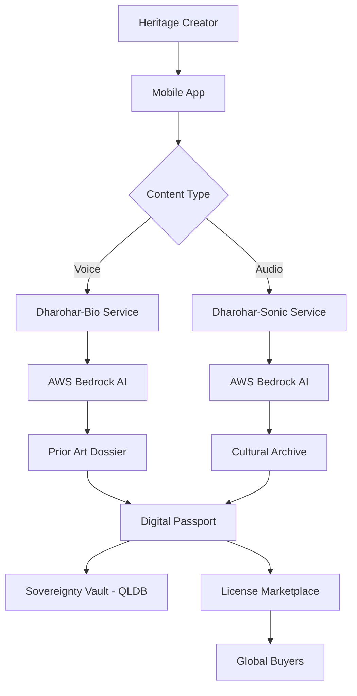

# Dharohar (धरोहर)🏛️

> **DHAROHAR (धरोहर) - Safeguarding India’s Wisdom with Digital Sovereignty**

[](https://aws.amazon.com/)
[](https://reactnative.dev/)
[](https://www.typescriptlang.org/)
[](https://aws.amazon.com/cdk/)

## 🎯 Mission Statement

Create the world's first **"Heritage-as-an-Asset"** infrastructure that enables indigenous communities to digitize, validate, and monetize their traditional knowledge and audio heritage while preventing bio-piracy.

**Impact Goal**: Protect 10,000+ traditional knowledge holders and generate ₹100 crores in direct community revenue within 3 years.

**Current Focus**: Dharohar-Bio (traditional medicine) and Dharohar-Sonic (audio heritage) modules using AWS Bedrock for AI processing.

---

## 📋 Project Status Overview

### ✅ **COMPLETED - Task 1: Project Setup and Core Infrastructure**

#### 🏗️ **Infrastructure Foundation**
- [x] **AWS CDK TypeScript Project** - Complete serverless infrastructure as code
- [x] **S3 Media Storage** - Bucket with CORS, versioning, and lifecycle policies
- [x] **DynamoDB Tables** - Assets and Creators tables with GSI indexes
- [x] **Cognito Authentication** - User Pool with custom attributes and Identity Pool
- [x] **API Gateway** - REST API with CORS configuration and resource structure
- [x] **QLDB Ledger** - Immutable ledger for legal records and sovereignty
- [x] **IAM Roles & Policies** - Secure access control for all services

#### 📱 **Mobile Application Foundation**
- [x] **React Native + Expo Setup** - Complete mobile app structure
- [x] **AWS Amplify Integration** - Authentication and API connectivity
- [x] **Core UI Screens** - Home, Voice Recording, Craft Video, QR Scanner, Marketplace, Profile
- [x] **Native Permissions** - Camera, microphone, location access configured
- [x] **Offline Support** - Local storage and sync capabilities

#### 🧪 **Development Environment**
- [x] **LocalStack Integration** - Local AWS services emulation with Docker
- [x] **Jest Testing Framework** - Infrastructure tests (7/7 passing)
- [x] **Setup Scripts** - Automated local environment configuration
- [x] **Environment Templates** - Configuration management for all environments

#### 📚 **Documentation & DevOps**
- [x] **Comprehensive Documentation** - Setup guides and architecture overview
- [x] **Git Configuration** - Proper .gitignore and repository structure
- [x] **Package Management** - Dependencies for backend and mobile app
- [x] **CDK Synthesis** - Infrastructure validation and deployment ready

---

## 🚧 **UPCOMING TASKS - Development Roadmap**

### 🔄 **Task 2: Authentication and User Management** *(Next Priority)*
- [ ] **2.1** Implement AWS Cognito authentication system
  - User pools for heritage creators, verifiers, and buyers
  - Role-based access control (RBAC) with custom attributes
  - Multi-factor authentication for sensitive operations
- [ ] **2.2** Write unit tests for authentication flows

### 🧬 **Task 3: Heritage-Bio Service Implementation**
- [ ] **3.1** Create voice recording and upload functionality
- [ ] **3.2** Integrate AWS Bedrock for dialect transcription
- [ ] **3.3** Write property test for transcription pipeline
- [ ] **3.4** Implement botanical knowledge mapping
- [ ] **3.5** Generate Prior Art Dossiers
- [ ] **3.6** Write property test for dossier generation

### 🎵 **Task 4: Heritage-Sonic Service Implementation**
- [ ] **4.1** Create audio recording and upload functionality
- [ ] **4.2** Integrate AWS Bedrock for audio transcription
- [ ] **4.3** Write property test for audio processing
- [ ] **4.4** Implement cultural archive generation

### 🎫 **Task 5: Digital Passport Service**
- [ ] **5.1** Implement Digital Passport generation
- [ ] **5.2** Write property test for passport uniqueness
- [ ] **5.3** Create QR code verification system
- [ ] **5.4** Write property test for passport persistence

### 🏛️ **Task 6: Sovereignty Vault Implementation**
- [ ] **7.1** Integrate Amazon QLDB for legal timestamping
- [ ] **7.2** Write property test for legal timestamping
- [ ] **7.3** Implement blockchain integration (optional for MVP)

### 👨‍💼 **Task 7: Expert Verification Workflow**
- [ ] **8.1** Create verifier dashboard and review system
- [ ] **8.2** Write property test for confidence-based routing
- [ ] **8.3** Implement expert feedback and model improvement

### 🏪 **Task 8: License Marketplace Implementation**
- [ ] **9.1** Create marketplace browsing and search
- [ ] **9.2** Integrate payment processing
- [ ] **9.3** Implement smart contract royalty distribution
- [ ] **9.4** Write property test for payment distribution
- [ ] **9.5** Write property test for license content delivery

### 📱 **Task 9: Mobile App UI/UX Enhancement**
- [ ] **10.1** Create voice-first interface for heritage creators
- [ ] **10.2** Build audio heritage documentation interface
- [ ] **10.3** Implement QR scanning and verification

### 🧪 **Task 10: Testing and Quality Assurance**
- [ ] **11.1** Write comprehensive unit tests
- [ ] **11.2** Write integration tests
- [ ] **11.3** Write property tests for remaining properties

### ⚡ **Task 11: Performance Optimization**
- [ ] **12.1** Implement performance monitoring
- [ ] **12.2** Optimize AI processing pipelines

### 🎯 **Task 12: Final Integration**
- [ ] **13.1** End-to-end system integration
- [ ] **13.2** Prepare hackathon demo

---

## 🏗️ **System Architecture**

### **Core Workflow: "Digitize → Validate → Monetize"**



### **Technology Stack**

#### **Backend Services**
- **AWS CDK** - Infrastructure as Code
- **AWS Lambda** - Serverless compute
- **Amazon S3** - Media storage
- **DynamoDB** - NoSQL database
- **AWS Bedrock** - GenAI for transcription and audio analysis
- **Amazon QLDB** - Immutable ledger
- **API Gateway** - REST API management

#### **Mobile Application**
- **React Native** - Cross-platform mobile development
- **Expo** - Development and deployment platform
- **AWS Amplify** - Authentication and API integration
- **TypeScript** - Type-safe development

#### **Development & Testing**
- **LocalStack** - Local AWS services emulation
- **Jest** - Testing framework
- **Docker** - Containerization
- **GitHub Actions** - CI/CD (planned)

---

## 🚀 **Quick Start Guide**

### **Prerequisites**
- Node.js 18+ and npm
- Docker and Docker Compose
- AWS CLI configured
- Expo CLI for mobile development

### **1. Clone and Setup**
```bash
git clone https://github.com/adityatiwari12/Dharohar-MVP.git
cd Dharohar-MVP
npm install
```

### **2. Local Development Environment**
```bash
# Start LocalStack services
npm run localstack

# In another terminal, setup AWS resources
chmod +x scripts/setup-localstack.sh
./scripts/setup-localstack.sh
```

### **3. Configure Environment**
```bash
cp .env.example .env
# Edit .env with your configuration
```

### **4. Run Infrastructure Tests**
```bash
npm test
```

### **5. Deploy Infrastructure (Optional)**
```bash
# For AWS deployment
npm run bootstrap  # First time only
npm run deploy
```

### **6. Run Mobile App**
```bash
cd mobile-app
npm install --legacy-peer-deps
npm start
```

---

## 🎯 **Hackathon MVP Scope**

### **Phase 1: Core Demo (48 Hours)**
1. **Dharohar-Bio**: Voice recording → AWS Bedrock transcription → Prior Art PDF
2. **Dharohar-Sonic**: Audio recording → AWS Bedrock transcription → Cultural archive
3. **Digital Passport**: QR code generation with basic asset information
4. **Mobile UI**: React Native app with voice commands and audio recording

### **Demo Flow**
1. Record traditional remedy in Hindi/English
2. Record folk song or oral story
3. Generate Digital Passport with QR code
4. Show marketplace preview with licensing options

---

## 📊 **Success Metrics & KPIs**

### **Impact Goals (3 Years)**
- 🎯 **Community Reach**: 10,000+ heritage creators onboarded
- 💰 **Economic Impact**: ₹100 crores direct revenue to communities
- 📚 **Knowledge Preservation**: 50,000+ traditional practices documented
- ⚖️ **Legal Protection**: 1,000+ prior art dossiers filed

### **Technical Metrics**
- ⚡ **Performance**: <2s page load, 99.9% API uptime
- 🎯 **Accuracy**: 95%+ voice transcription, 90%+ authenticity detection
- 💸 **Cost Efficiency**: <₹10 per asset processed

---

## 🧪 **Testing Strategy**

### **Current Test Coverage**
- ✅ **Infrastructure Tests**: 7/7 passing
- ✅ **CDK Synthesis**: Working correctly
- ✅ **LocalStack Integration**: Functional

### **Planned Testing**
- **Unit Tests**: Component-level testing
- **Integration Tests**: End-to-end workflows
- **Property-Based Tests**: AI model validation
- **Performance Tests**: Load and stress testing

---

## 🤝 **Contributing**

### **Development Workflow**
1. Fork the repository
2. Create a feature branch (`git checkout -b feature/task-X-feature-name`)
3. Follow the task structure in `.kiro/specs/dharohar-craft-platform/tasks.md`
4. Write tests for new functionality
5. Ensure all tests pass (`npm test`)
6. Commit with descriptive messages
7. Push and create a Pull Request

### **Code Standards**
- TypeScript for type safety
- ESLint and Prettier for code formatting
- Jest for testing
- Conventional commits for git messages

---

## 📁 **Project Structure**

```
dharohar-platform/
├── .kiro/specs/dharohar-craft-platform/    # Project specifications
│   ├── requirements.md                      # Detailed requirements
│   ├── design.md                           # System design document
│   └── tasks.md                            # Implementation tasks
├── lib/                                    # AWS CDK infrastructure
├── bin/                                    # CDK entry points
├── mobile-app/                             # React Native application
│   ├── src/screens/                        # Mobile app screens
│   └── App.tsx                             # Main app component
├── test/                                   # Test files
├── scripts/                                # Setup and utility scripts
├── docker-compose.yml                      # LocalStack configuration
└── README.md                               # This file
```

---

## 📄 **License**

This project is licensed under the MIT License - see the [LICENSE](LICENSE) file for details.

---

## 🙏 **Acknowledgments**

- **Indigenous Communities** across India for sharing their traditional knowledge
- **AWS** for providing cloud infrastructure and AI services
- **Open Source Community** for tools and libraries
- ** AI For Bharat Hackathon Organizers** for the opportunity to build impactful technology

---

## 📞 **Contact & Support**

- **Team MLOps 4.0**: Aditya Tiwari, Akshay Khanna, Aryan Singh bhadoria, Anvesh Trivedi
- **Documentation**: Check `.kiro/specs/` for detailed specifications
- **Local Development**: Use LocalStack for testing without AWS costs

---

**Built with ❤️ for India's cultural heritage preservation**

*Last Updated: January 2026*#


