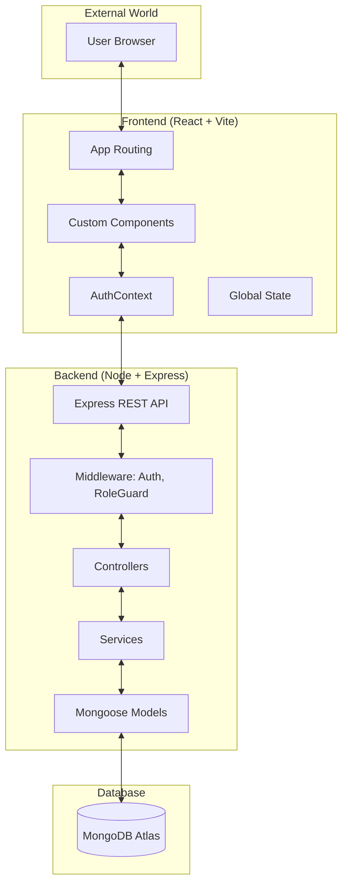

# 🏛️ System Architecture

Dharohar is built on a **MERN** (MongoDB, Express, React, Node) stack, utilizing a modern decoupled architecture.

---

## 🏗️ High-Level Component Diagram

---

## 🛠️ Technology Stack Breakdown

| Layer | Technology | Primary Purpose |
| :--- | :--- | :--- |
| **Frontend UI** | **React 18** | Component-based interactive user interface. |
| **Frontend Language** | **TypeScript** | Type safety and enhanced developer experience. |
| **Styling** | **Vanilla CSS** | Custom, high-performance modular styles. |
| **Build Tool** | **Vite** | Blazing-fast compilation and HMR. |
| **Backend Framework** | **Node.js + Express** | Scalable, event-driven RESTful API. |
| **Database** | **MongoDB** | NoSQL flexibility for document archival. |
| **ORM** | **Mongoose** | Schema-based modeling and validation. |
| **Authentication** | **JWT (JSON Web Tokens)** | Secure, stateless session management. |

---

## 🔐 Security & Access Control

### Role-Based Access Control (RBAC)
Dharohar implements a strict RBAC policy across four distinct roles:
1. **Community**: Submits heritage assets.
2. **Reviewer**: Validates and approves/rejects submissions.
3. **General**: Public users applying for research/commercial licenses.
4. **Admin**: Platform governors managing final license approvals.

### Data Protection
- **BCrypt**: Hashing and salting of user passwords.
- **Role Guards**: Backend middleware that intercepts requests and validates roles before execution.
- **Protected Routes**: Frontend navigation guards that prevent unauthorized access.
