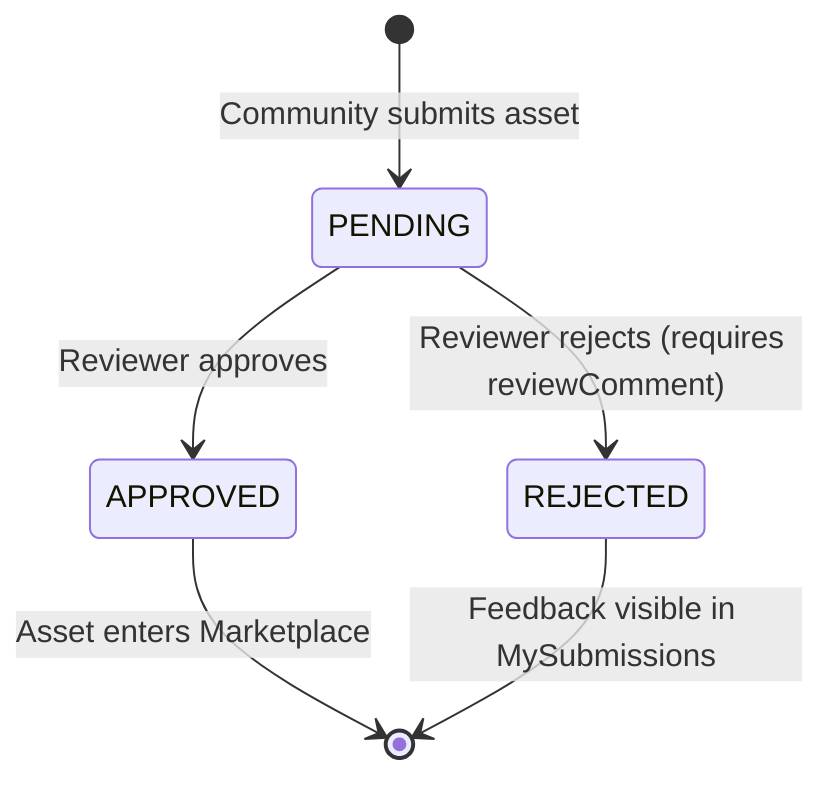
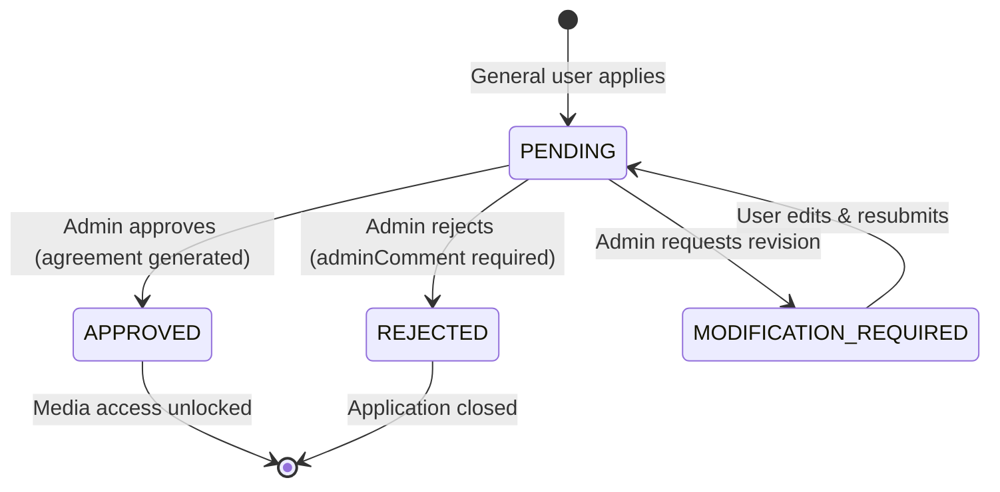

# ⚙️ State Machine Enforcement

DHAROHAR manages two parallel state machines: one for **Cultural Assets** (archival process) and one for **License Applications** (governance process). Both are enforced at the **service layer** with explicit status-gate checks before any transition is allowed.

---

## 1. Asset State Machine

### States

| State | Meaning |
|:------|:--------|
| `PENDING` | Submitted by community, awaiting reviewer decision |
| `APPROVED` | Archived and published to the Marketplace |
| `REJECTED` | Denied archival; feedback given to submitter |

### Transition Diagram



### Enforcement

The `approvalStatus` field is validated by Mongoose enum:
```js
approvalStatus: {
    type: String,
    enum: ['PENDING', 'APPROVED', 'REJECTED'],
    default: 'PENDING'
}
```

The reviewer action resolves the state:
- `PATCH /assets/:id/approve` → sets `approvalStatus = 'APPROVED'`
- `PATCH /assets/:id/reject` → sets `approvalStatus = 'REJECTED'`, saves mandatory `reviewComment`

### Gate: License Application Pre-check

The asset state machine directly gates license applications. In `licenseService.js`:
```js
if (asset.approvalStatus !== 'APPROVED') {
    throw new Error('Can only apply for licenses on approved assets'); // 403
}
```
No license can be submitted for a `PENDING` or `REJECTED` asset.

---

## 2. License Application State Machine

### States

| State | Meaning |
|:------|:--------|
| `PENDING` | Application submitted, awaiting admin review |
| `APPROVED` | License granted; agreement generated, media unlocked |
| `REJECTED` | Application denied; adminComment mandatory |
| `MODIFICATION_REQUIRED` | Admin requests changes; user must resubmit |

### Transition Diagram



### Enforcement — Status Gate Pattern

Each transition function in `licenseService.js` explicitly guards illegal state changes using a **status gate**:

#### Approve (PENDING → APPROVED)
```js
if (license.status !== 'PENDING') {
    throw new Error(`Cannot approve license with status "${license.status}"`); // 409
}
```

#### Reject (PENDING → REJECTED)
```js
if (license.status !== 'PENDING') {
    throw new Error(`Cannot reject license with status "${license.status}"`); // 409
}
```

#### Request Modification (PENDING → MODIFICATION_REQUIRED)
```js
if (license.status !== 'PENDING') {
    throw new Error(`Cannot request modification for license with status "${license.status}"`); // 409
}
```

#### Resubmit (MODIFICATION_REQUIRED → PENDING)
```js
if (license.status !== 'MODIFICATION_REQUIRED') {
    throw new Error('Resubmission only allowed for licenses requiring modification'); // 409
}
```

> **Key Design Principle:** All state transitions return HTTP `409 Conflict` when an illegal transition is attempted. This prevents race conditions and ensures transitions can only ever follow the defined graph edges.

---

## 3. Transaction Safety

All state-mutating operations in `licenseService.js` are wrapped in **MongoDB transactions** to ensure atomicity:

```js
const session = await mongoose.startSession();
session.startTransaction();
try {
    // 1. Validate current state
    // 2. Mutate state
    // 3. Write audit log entry
    await session.commitTransaction();
} catch (error) {
    await session.abortTransaction(); // rolls back on any failure
    throw error;
} finally {
    session.endSession();
}
```

This guarantees that the **AuditLog entry is always consistent with the state change** — no partial writes are possible.

---

## 4. State Effects Summary

| Transition | Side Effect |
|:-----------|:------------|
| `PENDING → APPROVED` (Asset) | Asset enters Marketplace |
| `PENDING → APPROVED` (License) | `agreementText` generated, media unlocked |
| `PENDING → REJECTED` (Asset) | `reviewComment` saved |
| `PENDING → REJECTED` (License) | `adminComment` saved |
| `PENDING → MODIFICATION_REQUIRED` | `adminComment` saved, edit form revealed |
| `MODIFICATION_REQUIRED → PENDING` | `adminComment` cleared, re-enters review queue |
